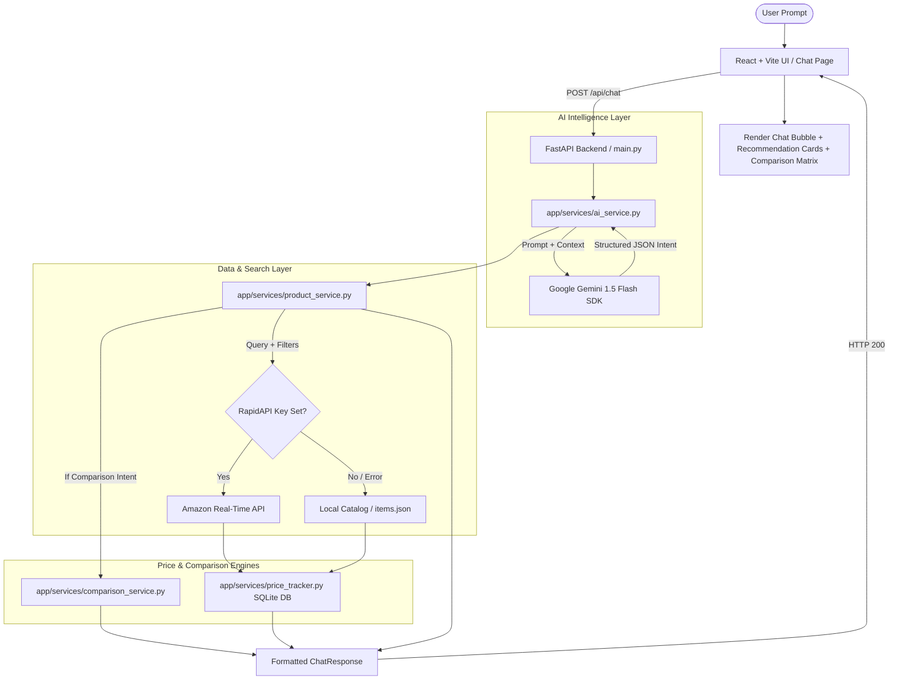

# 🛍️ Buyzo — AI-Powered Shopping Brain & E-Commerce Companion


Buyzo is an advanced AI-driven e-commerce assistant engineered to transform online shopping into a conversational, intelligent, and decision-focused experience. Powered by **Google Gemini 1.5 Flash** and live product APIs, Buyzo goes beyond simple keyword search to understand user intent, budget constraints, feature priorities, and multi-turn context—delivering precise product recommendations, automated side-by-side comparisons, and price drop tracking in real time.

---

## 🌟 Key Features

### 🧠 1. Conversational Intent Parsing & Reasoning
* **Natural Language Queries**: Understands shopping queries like *"I need a lightweight laptop for video editing under ₹80k with good battery life"*.
* **Smart Attribute Extraction**: Extracts categories, budget limits, min/max price ranges, target brands, and specific feature keywords (e.g. *"200MP camera"*, *"RTX 4060"*, *"OLED"*).
* **Multi-Turn Context & Memory**: Seamlessly resolves follow-up queries like *"show me cheaper ones"*, *"what about Samsung?"*, or *"which of these has a better camera?"*.

### ⚡ 2. Live Amazon Integration & Hybrid Fallback
* **Real-Time Catalog Fetching**: Integrates with live e-commerce data (via RapidAPI Amazon India) for accurate pricing, ratings, images, and buy links.
* **Instant Fallback Engine**: Seamlessly transitions to an enriched local database (`items.json`) if API limits are reached, ensuring 100% uptime and instant offline responses.

### ⚔️ 3. Automated Side-by-Side Product Comparison Matrix
* **Comparison Engine**: Detects comparison intent (e.g. *"Compare NovaBook Air 14 vs Quantum X Pro"*) and builds a structured feature-by-feature matrix.
* **Smart Winner Highlights**: Highlights the winner per attribute (Price, Rating, Camera, Battery, Value for Money) and generates an AI verdict explaining *why* one product beats another.

### 📉 4. Price History Tracking & Drop Alerts
* **SQLite Price Engine**: Tracks price movements over time to calculate actual percentage and rupee drops.
* **Visual Badges & Alerts**: Displays price-drop indicators (e.g., *"₹5,000 drop in last 7 days"*) and allows users to set price drop alerts.

### 💎 5. Premium Modern UI / UX
* **Glassmorphism Aesthetic**: Sleek dark mode design with frosted glass cards, dynamic gradients, and smooth Framer Motion micro-animations.
* **Interactive Product Drawer**: Click any product card for deep-dive specifications, feature lists, price drop badges, and instant affiliate buy links.
* **Wishlist & Saved Searches**: Easily bookmark products to local storage for quick access.

---

## 🏗️ Architecture & Data Flow



---

## 🛠️ Tech Stack

### Frontend
| Technology | Description |
| :--- | :--- |
| **React 18** | UI framework with hooks and modular components |
| **Vite** | Lightning-fast build tool and development server |
| **Tailwind CSS** | Custom glassmorphism utilities and responsive design system |
| **Framer Motion** | Fluid animations, page transitions, and loader effects |
| **Lucide React** | Modern iconography set |
| **TanStack Query** | Async state management and caching |
| **React Router DOM** | Client-side route management |

### Backend
| Technology | Description |
| :--- | :--- |
| **FastAPI** | High-performance Python async web framework |
| **Python 3.10+** | Core programming language |
| **Google Gemini SDK** | `google-genai` library powering Gemini 1.5 Flash intent parsing |
| **Pydantic v2** | Data validation and schema enforcement |
| **SQLite3** | Embedded database for historic price tracking |
| **Uvicorn** | ASGI server for production and development |

---

## 📂 Detailed Project Structure

```text
buyzo/
├── README.md                      # Complete project documentation
├── .env                           # Root environment config (Supabase/Vite)
├── backend/                       # FastAPI Backend
│   ├── .env                       # Backend API keys (GEMINI_API_KEY, RAPIDAPI_KEY)
│   ├── requirements.txt           # Python dependencies
│   └── app/
│       ├── main.py                # Main FastAPI routes & CORS setup
│       ├── data/
│       │   ├── items.json         # Rich local fallback product database
│       │   └── prices.db          # SQLite price history database
│       ├── models/
│       │   └── schemas.py         # Pydantic data models (Product, ChatRequest, etc.)
│       └── services/
│           ├── ai_service.py      # Gemini 1.5 Flash intent extraction & reasoning
│           ├── product_service.py # Live Amazon search & local filter logic
│           ├── comparison_service.py # Side-by-side comparison matrix generator
│           └── price_tracker.py   # SQLite price drop tracking engine
│
└── frontend/                      # React + Vite Frontend
    ├── index.html                 # HTML entry point
    ├── package.json               # Frontend dependencies & scripts
    ├── tailwind.config.ts         # Tailwind design system configuration
    ├── vite.config.ts             # Vite dev server & proxy settings
    └── src/
        ├── App.tsx                # Main Router & Provider setup
        ├── main.tsx               # React DOM entry point
        ├── index.css              # Glassmorphism CSS variables & styles
        ├── components/
        │   ├── chat/              # ChatBubble, ChatInput components
        │   ├── layout/            # AppLayout, Navigation
        │   ├── product/           # RecommendationCard, ProductDrawer
        │   └── ui/                # Shadcn UI primitives (Button, Dialog, etc.)
        └── pages/
            ├── Index.tsx          # Landing hero page with quick search
            ├── Chat.tsx           # Primary AI shopping chat interface
            ├── Wishlist.tsx       # Saved products page
            ├── PriceTracking.tsx  # Price drop alert tracker page
            └── NotFound.tsx       # 404 fallback page
```

---

## 📡 API Endpoint Reference

### 1. `POST /api/chat`
Main conversational endpoint. Parses message intent, retrieves product matches or comparison matrices, and returns an AI response.

**Request Body (`ChatRequest`):**
```json
{
  "message": "Find gaming laptops with RTX 4060 under 90000",
  "history": [
    { "role": "user", "content": "Hi, I need a laptop for gaming" },
    { "role": "assistant", "content": "What is your target budget?" }
  ],
  "last_product_ids": ["p1", "p2"]
}
```

**Response Body (`ChatResponse`):**
```json
{
  "reply": "Here are the top gaming laptops featuring an NVIDIA RTX 4060 within your budget of ₹90,000.",
  "products": [
    {
      "id": "p1",
      "name": "Quantum X Pro Gaming Laptop",
      "category": "laptop",
      "price": 85000,
      "originalPrice": 98000,
      "rating": 4.8,
      "reviewCount": 120,
      "brand": "Quantum",
      "image": "https://images.unsplash.com/photo-1603302576837-37561b2e2302",
      "features": ["RTX 4060 8GB GPU", "16GB DDR5 RAM", "1TB Gen4 SSD", "144Hz FHD Display"],
      "description": "High-performance gaming laptop equipped with NVIDIA RTX 4060.",
      "buy_url": "https://amazon.in/dp/example",
      "price_drop": 13000,
      "price_drop_days": 7,
      "source": "local"
    }
  ],
  "comparison": null,
  "recommendation_reason": "Quantum X Pro is recommended as it offers an RTX 4060 GPU and 1TB SSD under ₹85,000.",
  "best_product_id": "p1"
}
```

### 2. `GET /api/products`
Retrieves the full featured catalog (up to 12 items) directly from live sources or local storage.

**Response:** Array of `Product` objects.

---

## ⚙️ Environment Variables Setup

Create a `.env` file inside the `backend/` directory:

```env
# Google Gemini API Key (Required for AI Intent Extraction & Reasoning)
GEMINI_API_KEY=your_gemini_api_key_here

# RapidAPI Key for Real-Time Amazon India Data (Optional - falls back to items.json if empty)
RAPIDAPI_KEY=your_rapidapi_key_here
```

Create a `.env` file in the root `buyzo/` directory for Frontend/Supabase integration (optional):

```env
VITE_SUPABASE_URL=https://your-supabase-project.supabase.co
VITE_SUPABASE_PUBLISHABLE_KEY=your_supabase_publishable_key
```

---

## 🚀 Quickstart & Developer Setup

### Prerequisites
* **Node.js** (v18.x or higher) & `npm`
* **Python** (v3.10 or higher) & `pip`

### Step 1: Start the Backend Server

```bash
# 1. Navigate to backend directory
cd backend

# 2. Create virtual environment
python -m venv venv

# 3. Activate virtual environment
# Windows (PowerShell / CMD):
venv\Scripts\activate
# Mac / Linux:
source venv/bin/activate

# 4. Install dependencies
pip install -r requirements.txt

# 5. Launch FastAPI application server
python app/main.py
```
> The backend server will start at `http://localhost:8000`. Swagger API documentation is available at `http://localhost:8000/docs`.

### Step 2: Start the Frontend Application

```bash
# 1. Open a new terminal and navigate to frontend directory
cd frontend

# 2. Install dependencies
npm install

# 3. Start Vite development server
npm run dev
```
> The frontend app will start at `http://localhost:5173`.

---

## 💡 Example Prompts to Test

Try entering these in the Buyzo chat interface to test different AI capabilities:

1. **Category & Budget Search**:
   > *"Find smartphones under ₹30,000 with a great camera and high refresh rate screen"*
2. **Feature Specific**:
   > *"Show me noise cancelling wireless earbuds with long battery life under ₹15,000"*
3. **Side-by-Side Comparison**:
   > *"Compare NovaBook Air 14 vs Quantum X Pro Gaming Laptop"*
4. **Follow-Up Querying**:
   > First prompt: *"Show me gaming laptops"*
   > Follow-up: *"Show me cheaper options under ₹70,000"*
5. **Brand Filtering**:
   > *"Show me Google Pixel phones"*

---

## 📄 License

Distributed under the **MIT License**. See `LICENSE` for more information.
